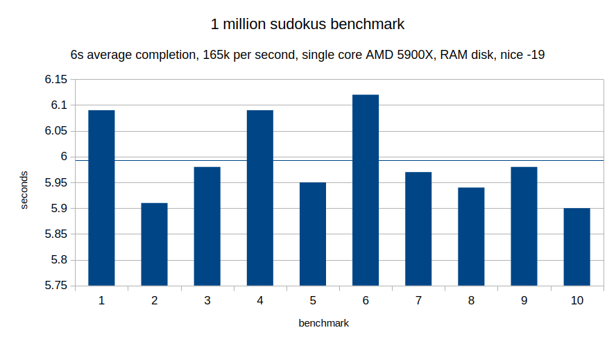

# x86_64 NASM Sudoku
Sudoku solver written in x86-64 NASM assembly.
It is statically compiled and doesn't rely on the C stdlib, but does rely on Linux syscalls for I/O and is thus incompatible with other operating systems.
The produced binary is roughly 1.5KiB.

The execution speed heavily depends on I/O speed and how fast the system can process the syscalls.
The following chart shows the time required to process a million sudokus when loaded from a RAM disk.

This is was my first time using assembly, and I thus kept some features outside the scope of this project to finish it in a reasonable amount of time.
It doesn't have an extensive CLI and instead relies on using a pipe to load the sudokus, nor does it do backtracking.
